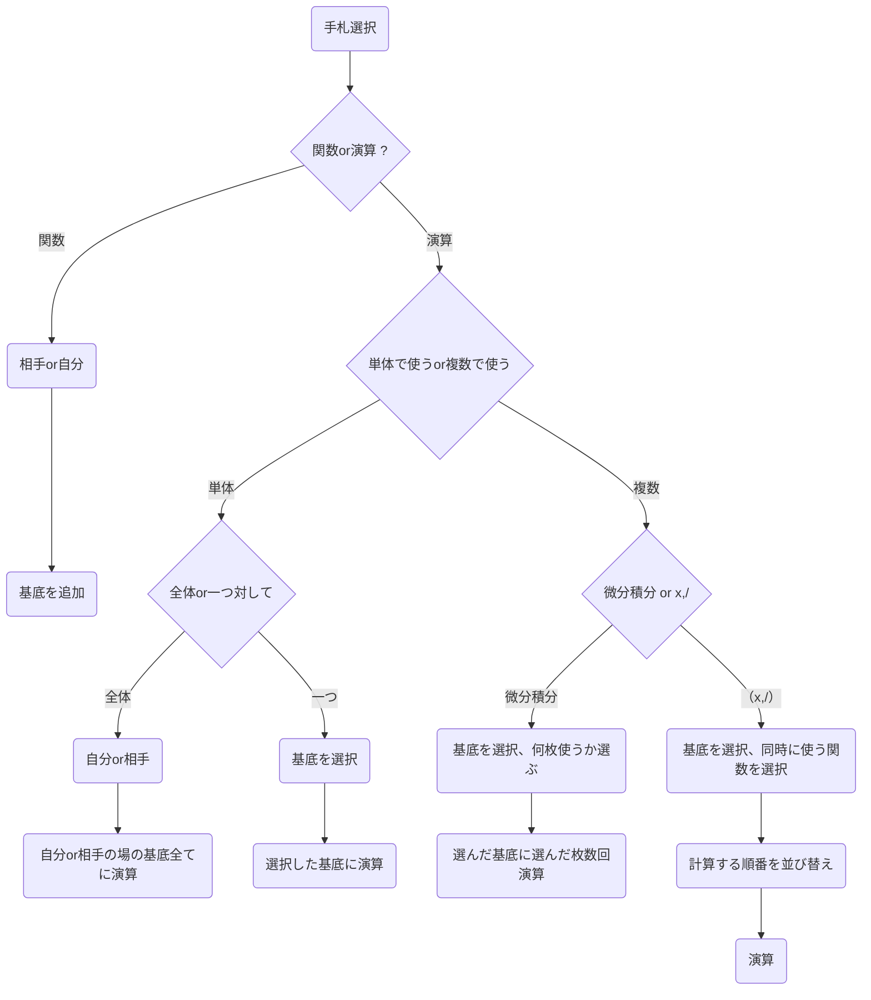

# ナブラ演算子ゲーム
ナブラ演算子ゲームとは1vs1形式のカードゲームであり、工夫して演算を繰り返し、勝利を目指すゲームである。
## ゲームの流れ
- 各プレイヤーはそれぞれ場に「1」「x」「x^2」の基底を用意する。
- 各プレイヤーは山札から7枚ずつカードを引き、手札とする
- 先攻後攻を決め、場の「基底」に対して交互に「操作」を行う。
- 先に相手の場の基底を全て消したプレイヤーの勝利となる。

## 基底
本ゲームにおける「基底」とは場に書かれた個々の関数を示すものであり、線形代数学などにおける基底とは異なる。例えば、場に1, x, x^2が書かれているとき、1とxとx^2という３つの基底が存在していることになる。
以下のいずれかの条件を満たした基底は場から消える。
- 演算により値が0になった。（f(x)=0となった）
- 演算により無限大または負の無限大に発散した。
- 演算により同じ場の基底と「線形従属」（定数倍）になった。

## 操作
ターン毎にプレイヤーが行える操作には、「基底の追加」と「演算」の二つがある。1ターンにプレイヤーは一度だけ操作することができる。（「一度操作する」とは、「一枚使う」とは意味が異なるので注意）
### 基底の追加
手札の中に「関数カード」があるとき、その中の一つを選んで、自分か相手の場に追加することができる。これで１回分の操作とする。

#### 関数カード一覧：
[cos(x)], [sin(x)], [exp(x)], [x], [x^2], [1], [0]
### 演算
「関数」以外のカードはすべて「演算」に用いられる。円z何の仕方は各々のカードによって異なるが、以下の３つは共通したルールである。
- 一回の操作で行える演算は一度だけである。
- 「反則行為」を行った場合には、その演算を行ったほうのプレイヤーの負けとする。
- 「演算」のための計算は「演算」を行ったプレイヤーが責任をもって行う。

#### 演算に使用できるカードの一覧
以下二つの演算子のみ、自分か相手いずれかの場にある基底すべてに作用する。
- [∇]：xで一回微分する。
- [Δ]：xで二回微分する。

以下二つの演算子のみ、ひとつの基底に対してであれば同時に何枚も使用できる。
- [d/dx]：基底の一つをxで微分する
- [∫]：基底の一つをxで積分する。
以下二つの演算子のみ、ひとつの式で表せれば一度の演算でいくつも使える。
- [×]：基底の一つに対し、手札の関数との情報を行う

例：[x^2]に対し、[×][exp(x)][x][sin(x)] → (x^2)*(exp(x))*sin(x)
- [÷]：基底の一つに対し、手札の関数との情報を行う。基底・関数の計算順序は自由。

例：場にある[x^2]に対し、右から[sin(x)][÷]、左から[÷][exp(x)] → (sin(x))/(x^2)*(e^x)

以下すべての演算子は、一回の操作について一つの基底に対して一枚のみ作用する。
- [lim(x→+∞)]：基底の一つに対し、xを限りなく+∞に近づけた時の極限をとる。
- [lim(x→-∞)]：基底の一つに対し、xを限りなく-∞に近づけた時の極限をとる。
- [lim(x→0)]：基底の一つに対し、xを限りなく0に近づけた時の極限をとる。
- [limsup(x→+∞)]：基底の一つに対しxを限りなく+∞に近づけた時の上限値をとる。
- [liminf(x→+∞)]：基底の一つに対しxを限りなく+∞に近づけた時の下限値をとる。
- [√]：基底の一つの平方根をとる。
- [f^-1]：基底の一つの逆関数をとる。
- [log]：基底の一つの対数をとる。

以下の演算は「反則行為」とする。
- 実数の範囲で定義できない演算
- 定義域に含まれない値にxを近づける極限をとる演算
- 関数を振動させる極限をとる演算

私自身の「反則行為」についての推測ですが、ある１点でも定義できるなら演算をしてもよいという解釈でいいと思います。


lim_{x→0} log x は lim_{x→+0} log xということで許容する。
f^{-1} は単調で可逆な形（ax+b, exp, log, 奇数冪など）に限定すると実装・裁定が楽です。　いったんはこれで様子見する。
exp x に f^{-1} → log(x) となる。

## 使用技術
仮：SymPy



ファイル構造
```
.
├── README.md
├── __pycache__
│   └── main.cpython-312.pyc
├── eslint.config.js
├── index.html
├── main.py
├── memo.txt
├── package-lock.json
├── package.json
├── postcss.config.js
├── public
│   └── vite.svg
├── src
│   ├── App.css
│   ├── App.jsx
│   ├── components
│   │   ├── FunctionKeypad.jsx
│   │   └── MathView.jsx
│   ├── features
│   │   ├── calclator
│   │   │   └── useCalculatorLogic.js
│   │   └── game
│   │       ├── components
│   │       │   ├── ControlPanel.jsx
│   │       │   ├── FieldView.jsx
│   │       │   └── HandView.jsx
│   │       └── data
│   │           ├── cards.js
│   │           ├── limitApi.js
│   │           └── operators.js
│   ├── index.css
│   ├── main.jsx
│   ├── pages
│   │   ├── CalculatorPage.jsx
│   │   └── GamePage.jsx
│   └── utils
│       └── calcLogic.js
├── tailwind.config.js
├── tree.txt
└── vite.config.js

12 directories, 29 files

```